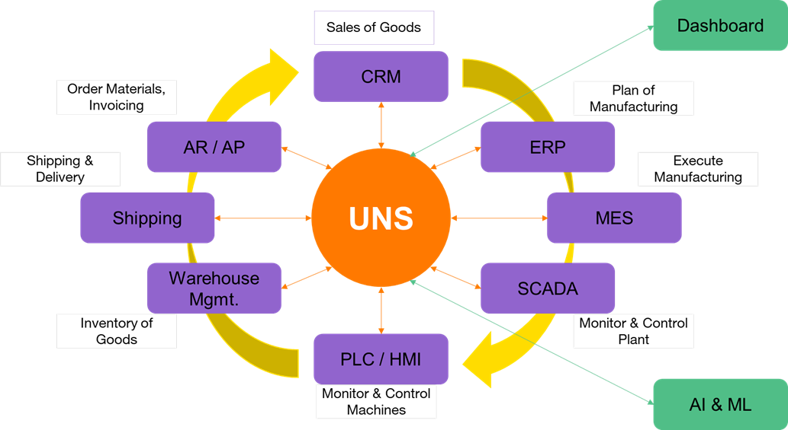

# Unified Name Space
This project aims to create an open sourced option for setting up a unified name space for IIOT transformation.

My objective is to build an open source, free to use UNS solution for the community which can be enhanced and adapted by other enthusiasts. 

All components used in this solution are community versions and I do not own any rights on them . Most of them also provide a commercial / enterprise version which may also be considered to have better tool support

## What is the Unified Name Space?
A unified namespace is a ***software solution*** that acts as a ***centralized repository*** of data, information, and context where any application or device can consume or publish data needed for a specific action via an ***event driven*** and ***loosely coupled architecture***. ​

This is a critical concept to allow scalability by preventing point to point connectivity.

**References / Further Reading**
1. [Video explaining UNS](https://youtu.be/PB_9HIgSCWc)
1. [UNS Q&A by Walter Reynolds](https://youtu.be/IiUZTSGjCQI)
1. [Event driven architecture on Wikipedia](https://en.wikipedia.org/wiki/Event-driven_architecture)​
1. [Advantages of Event Driven Architecture](https://developer.ibm.com/articles/advantages-of-an-event-driven-architecture/)

## Architecture 

## Technology Choices
The following section lists the various options and technology choices that I evaluated and the reasoning for choosing them.
This should hopefully also give you possible alternatives to consider if you choose to implement and extend this for your needs.
The opinions below are my personal ones with no influnce from the companies that built them

### Clustering at the Edge with Kubernetes
To run the MQTT broker on the Edge, a cluster is *** not *** a prerequisite.  If you do not have a business need for a high availability MQTT cluster, runnning just a single instance ( probably dockerized ) would be a lot more easier.

Even for a clustered setup most of the MQTT brokers do provide an option for clustering however running this cluster on K8s provides significant benefits for scaling, auto healing etc. 

I evaluated the following K8s options because it needs to be a extremely light weight and high performant distribution to be able to run on the edge ( constraint enviornments). Any of these is a perfectly good choice depending on your context.
1. [MicroK8s](https://microk8s.io/)
1. [K3s](https://k3s.io/)

There are quite some comparisons between the the k8s distributions on the net so I am not going to list detailed comparison here.

I finally choose to go ahead with ***MicroK8s*** because 
* Most of my enviornment was on Ubuntu hence enabling a snap for microk8s was very easy
* The inbuild addons and the ease of enabling them without wading through YAML files
* The default CNI provided for the cluster is Calico which claimed to be more performant
* Setting up a High Availability cluster is extremely easy by adding multiple master nodes
> **Note:** Avoid seting up high availability and multiple masters for your edge cluster as this increases the resource consumption & load on the edge devices. A single master node should suffice majority of your availability requirements if you actually even need a k8s cluster on the edge in the first place

* Having a bit more experience with Ubuntu I found the documentation and guides a lot more easy to find and follow, including the community support, especially troubleshooting. As a K8s noob this really helped.

However microk8s did show up some limitations as well as bugs. Details of these are in the [k8scluster](./01_k8scluster/Readme.md). The link will provide details of all the addons, workarounds etc. that I did for bringing up my cluster. If you choose to setup your k8s with a different distribution, each of those addons could be setup / configured albiet in a different manner.

Some key limitations to bear in mind
* I faced some stability issues while trying to run this lower raspberry pi (pi3)
* microk8s is not available for every linux distribution. 

### **MQTT Broker**
The backbone of the ***Unified Name Space*** is the MQTT broker.
I evaluated and read the user guides of the following brokers (opensource versions only). All three also provide commercial / enterprise versions which is recommended for more robust setup and professional support
1. [EMQX](https://www.emqx.io/)
2. [VERNEMQ](https://vernemq.com/)
3. [HIVEMQ](https://www.hivemq.com)

While HIVEMQ has the best documentation and community support I decided try out EMQX for the following reasons
* EMQX is written in erlang which has a lower footprint than java (HIVEMQ). They also provide 2 versions of the broker, one specifically lightweight for edge deployment and the standard for enteprise or cloud deployment
* All the three have extension capabilities via standard as well as custom plugins. However I liked the rules plugin from EMQX which comes by default allowing for lot of flexibility for pre and post processing messages. Also EMQX seems to be supporting the ability to create plugins in y
* All three deploy very easily on K8s and all three have community (free) as well as commercial offering 
* All three support **MQTT 5** which is critical for manufacturers and **Sparkplug B** support

>**Important Note:** The community edition of these brokers do not provide all functionalies. e.g. EMQX community doesnt allow plugins to be triggered on message delivery (this is an enterprise feature). As I wanted this solution to be completely opensource and free, I decided to write an MQTT client subscribing to `"#"`. This works but is less efficient than creating a plugin within the broker and natively persisting the messages to a database

### **GraphDB**
I choose to go with [Neo4J](https://neo4j.com/) simply because it was the only graphDB I was aware of as well as the fact that it runs seamlessly on Kubernetes 

> **Note:** The clustering feature of neo4j on K8s is an enterprise feature and not available in the community version

### **Historian**

### Plugin / MQTT Client to subscribe and write to the above data bases

